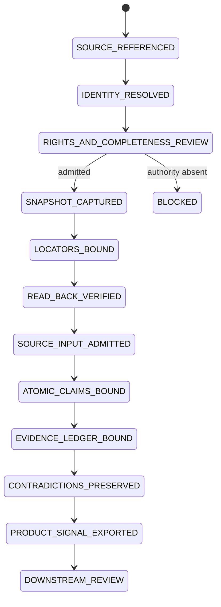

# AI Content Notes｜AI 高價值內容筆記與證據庫

> A private Evidence Plane that turns complete AI sources into source-constrained v7.1 cards, exact source packets, atomic claims, contradiction ledgers, product signals, machine receipts and review-gated knowledge projections.

## Start here

Two evidence programs currently coexist:

1. **Semantic Yield cards** — modified v7.1 card compilation and validation.
2. **Product Reverse Evidence Plane** — source registry, exact PDF/visual packet, atomic claims, evidence/contradiction ledgers and `product-signal@1`.

Neither program grants product implementation, user value, paid demand, legal acceptance, merge, release or production authority.

## Current Semantic Yield batch

Modified-flow catalog: [`evals/semantic-yield/README.md`](evals/semantic-yield/README.md)

Only one content item has run the modified Semantic Yield flow:

```text
evals/semantic-yield/CvRngaQZQ3Y/cards/
```

It contains ten stable cards and remains:

```text
PERSISTED_AND_READ_BACK → CONTINUE
```

Do not confuse it with `evals/live/CvRngaQZQ3Y/`, the retained transcript-only 12-card baseline.

## Active protocol

```text
governance/CARD_PROTOCOL_CURRENT.json
  → governance/CARD_PROTOCOL_V7_1.md
  → Git blob SHA-1 7f3019f4b41a90728cd48a523d742c7c59721bf6
```

The v7.1 prompt is immutable. Runtime adapters add subject/evidence contracts around it rather than modifying its bytes.

## Product Reverse Evidence Plane — merged state

The Stage 2/3 evidence Stack has been merged bottom-up to `main`:

```text
PR #52 source-registry C/K/E
merge 3326f24fabf1cc80c65e977870ee05746e162ab6
  ↓
PR #53 exact PDF bytes + visual locators
merge 0f7f551ebbca067a02621abd8a2d538189a8855b
  ↓
PR #73 atomic claims + evidence + contradiction + product-signal
merge beefeb0e792a771638ad1968db126d302729256d
```

Current exact Evidence Plane artifacts:

```text
PDF source digest
sha256:7350f0e3d29ace70a6c92343e5501b34763f452e057d9b8acef3829f57230ef6

source registry digest
sha256:1dcc8d6ca8f1282e9e319cefcca59a2278d203ba9e3ebecba52b8815e1c45166

product signal blob
88ea1d9a76ebda28182682b67808e45291639582

product signal digest
sha256:c756bbb8e5413892356b8c675f78a17837b3ac067fff064070e318548dbb1d0f
```

Current decision and evidence ceiling:

```text
decision             VALIDATE
authority            SOURCE_EVIDENCE_ONLY
source               PASS
runtime              ABSENT
user                 ABSENT
paid                 ABSENT
legal                ABSENT
```

The exact packet retains:

```text
unknown claim
claim:actual-company-internals-unknown

unresolved contradiction
contradiction:all-permissive-vs-lgpl-option
```

Named-product internal architectures remain `HYPOTHESIS` or `UNKNOWN`. The source's broad all-permissive claim is not license admission.

Read:

- [`docs/source-intake/AGENTS.md`](docs/source-intake/AGENTS.md)
- [`docs/source-intake/README.md`](docs/source-intake/README.md)
- [`docs/git/PRODUCT_REVERSE_EVIDENCE_STACK.md`](docs/git/PRODUCT_REVERSE_EVIDENCE_STACK.md)
- [`docs/traceability/product-reverse-evidence-handoff.json`](docs/traceability/product-reverse-evidence-handoff.json)

## Repository topology

```text
ai-content-notes/
├── AGENTS.md / CLAUDE.md
├── README.md
├── INTEGRATION_REQUIREMENTS.md
├── INDEX.md / CONTEXT.md
├── governance/                         # immutable prompt/workflow SSOT
├── templates/
├── schemas/
│   ├── source-manifest.schema.json
│   ├── source-registry.schema.json
│   ├── pdf-source-descriptor.schema.json
│   ├── atomic-claim.schema.json
│   ├── evidence-ledger.schema.json
│   ├── contradiction-ledger.schema.json
│   └── product-signal.schema.json
├── tools/
│   ├── source_registry.py
│   ├── pdf_source_adapter.py
│   ├── product_signal.py
│   └── existing acquisition/normalization/validation tools
├── tests/                              # positive and fail-closed controls
├── sources/                            # retained subjects when rights permit
├── evals/
│   ├── prompt-ab/
│   ├── live/
│   ├── semantic-yield/
│   ├── source-intake/
│   │   └── modern-web-architecture/
│   │       ├── source-descriptor.json
│   │       ├── source-registry.json
│   │       ├── readback-receipt.json
│   │       ├── visual-review.json
│   │       └── shadow-review.json
│   └── product-signal/
│       └── modern-web-architecture/
│           ├── claims.jsonl
│           ├── evidence-ledger.json
│           ├── contradictions.json
│           ├── product-signal.json
│           └── shadow-review.json
├── docs/
│   ├── source-intake/
│   │   ├── AGENTS.md
│   │   └── README.md
│   ├── runtime/README.md
│   ├── SEMANTIC_YIELD_INTEGRATION_STATUS.md
│   ├── traceability/product-reverse-evidence-handoff.json
│   └── git/
│       ├── STACKED_PRS.md
│       └── PRODUCT_REVERSE_EVIDENCE_STACK.md
└── .github/workflows/
```

## Directory-to-State-Machine ownership

| State / lane | Owning paths | Input | Output / receipt | Fail-closed boundary |
|---|---|---|---|---|
| `DISCOVERED` | source/ranking entry | candidate source | content/source ID | title/snippet-only blocks |
| `RIGHTS_AND_COMPLETENESS_REVIEW` | governance + source descriptors | source pointer | authority/completeness decision | missing authority stays blocked |
| `IDENTITY_RESOLVED` | source registry/adapters | exact URL/file/revision | immutable or revision-bound identity | mutable subject without revision blocks |
| `SNAPSHOT_CAPTURED` | acquisition/adapter lane | admitted subject | retained or external-reference packet | public visibility is not rights |
| `LOCATORS_BOUND` | source manifest/registry | source bytes | page/line/path/range/visual locators | material visuals require visual regions |
| `READ_BACK_VERIFIED` | registry/adapters | digest-bound packet | exact read-back receipt | change notification is not content proof |
| `SOURCE_INPUT_ADMITTED` | `evals/source-intake/` | exact PDF packet | `SOURCE_INPUT_ONLY` admission | identity does not prove factual truth |
| `ATOMIC_CLAIMS_BOUND` | `claims.jsonl` | admitted source | typed atomic claims | unsupported precision/locator fails |
| `EVIDENCE_LEDGER_BOUND` | evidence ledger | claims + dependency origin | source/evidence mapping | repeated retelling is not corroboration |
| `CONTRADICTIONS_PRESERVED` | contradiction ledger | challenged claims | unresolved conflict packet | conflict cannot be silently removed |
| `PRODUCT_SIGNAL_EXPORTED` | product-signal compiler | exact ledgers | `product-signal@1` | decision cannot exceed `VALIDATE` |
| `SEMANTIC_MODELED` | Semantic Yield runtime | source/evidence graph | cards and views | host projection is not source evidence |
| `HOST_VALIDATED` | validators | persisted outputs | deterministic reports | model-authored PASS is insufficient |
| `PERSISTED_AND_READ_BACK` | Git; future Doc/Sheet adapters | validated outputs | exact identity/read-back | prose/planned path is not persistence |
| `CONTINUE` / `DONE` | run state | all required lanes | cursor or terminal state | open visual/QG/Google lanes block DONE |

## Product Reverse source State Machine



## Product Reverse data flow

```mermaid
flowchart LR
    A[GitHub / PDF / Doc / Sheet / article] --> B[Identity + rights + completeness]
    B --> C[Snapshot or external reference]
    C --> D[Digest + page/line/range/visual locators]
    D --> E[Read-back receipt]
    E --> F[Atomic claims]
    F --> G[Evidence/dependency ledger]
    G --> H[Contradiction ledger]
    H --> I[product-signal@1]
    I --> J[ai-product-notes dossier]

    K[Drive notification] -. refetch only .-> B
    L[PDF internal-stack claim] -. hypothesis only .-> F
    I -. cannot prove .-> M[Runtime / user / paid / legal]
```

## Evidence lanes

```text
source identity != source factual accuracy
source statement != observed product truth
one origin repeated != corroboration
source pack != claim verification
model-run receipt != model quality
hosted CI != local runtime
product signal != product implementation
product implementation != user validation
user validation != paid validation
public code license != model/data/service/content rights
Google projection != Git completion authority
```

## Current Product Reverse closure

| Surface | Current state | Missing lane |
|---|---|---|
| Provider-neutral source registry | `MERGED / PASS` | live GitHub/Doc/Sheet adapters remain |
| Exact 34-page PDF packet | `MERGED / SOURCE_INPUT_ONLY` | source factual truth not granted |
| Material visual locators | `MERGED / PASS` | visual claims still require independent verification |
| Atomic claims | `MERGED / PASS` | independent corroboration absent |
| Evidence/dependency ledger | `MERGED / PASS` | runtime/user/legal lanes absent |
| Contradiction ledger | `MERGED / PASS` | license contradiction unresolved |
| `product-signal@1` | `MERGED / VALIDATE` | downstream product evidence only |
| Google Doc/Sheet authority | `OWNER_DECISION_PENDING` | #41 |
| Google adapters / transactions | `NOT_IMPLEMENTED` | #51 and shared projection contracts |
| Independent Shadow | `NOT_EXERCISED` | separate context/model review |
| User / paid / release | `ABSENT` | downstream owners |

## Deterministic validation

```bash
python -m pip install -r requirements-contracts.txt
ruff check tools tests
python -m py_compile tools/*.py tests/*.py
pytest -q

python tools/source_registry.py \
  --registry evals/source-intake/modern-web-architecture/source-registry.json \
  --check

python tools/pdf_source_adapter.py \
  --pdf /absolute/path/to/現代網頁設計架構擴充建議.pdf \
  --descriptor evals/source-intake/modern-web-architecture/source-descriptor.json \
  --output evals/source-intake/modern-web-architecture/source-registry.json \
  --receipt evals/source-intake/modern-web-architecture/readback-receipt.json \
  --check
```

Use the exact product-signal README/packet for compiler arguments; do not reconstruct commands from this summary.

## Merged Product Reverse Evidence Stack

```text
main
└── PR #52 source-registry contract/core/evals
    merge 3326f24fabf1cc80c65e977870ee05746e162ab6
    └── PR #53 exact PDF bytes + visual locators
        merge 0f7f551ebbca067a02621abd8a2d538189a8855b
        └── PR #73 atomic evidence + product-signal
            merge beefeb0e792a771638ad1968db126d302729256d
```

This proves GitHub branch/PR/merge and exact hosted lanes for their admitted subjects. It does not prove live Git Town execution, source truth, product internals, license clearance, user value or payment.

## Semantic Yield delivery snapshot

Materialized:

- immutable v7.1 prompt and lock pointer;
- rights-gated acquisition and normalization;
- current 10-card modified-flow batch and views;
- deterministic semantic validator with a partial evidenced QG subset;
- source-pack/model-run receipt foundations;
- repository Agent/State Machine/Stack governance.

Still incomplete:

- live provider/model invocation for the historical card batch;
- authorized frame/slide extraction and reviewed topology;
- remaining QG evidence;
- transactional Google Docs/Sheets and Drive revision adapters;
- exact Git Town executable admission and Worker canaries.

## Current Local Handoff

Read [`docs/traceability/product-reverse-evidence-handoff.json`](docs/traceability/product-reverse-evidence-handoff.json).

Exactly one item is `ACTIVE`: Google authority/adapters and generic projection-contract handoff. Additional-source and independent-review work remain blocked successors.

## Completion and privacy

A content item is `DONE` only after complete-source/rights review, immutable prompt verification, registry-consistent outputs, all required gates, document/sidecar read-back and exact status write-back. Source, run and product-signal receipts strengthen identity and routing; they do not authorize completion, product truth, market truth or release by themselves.
