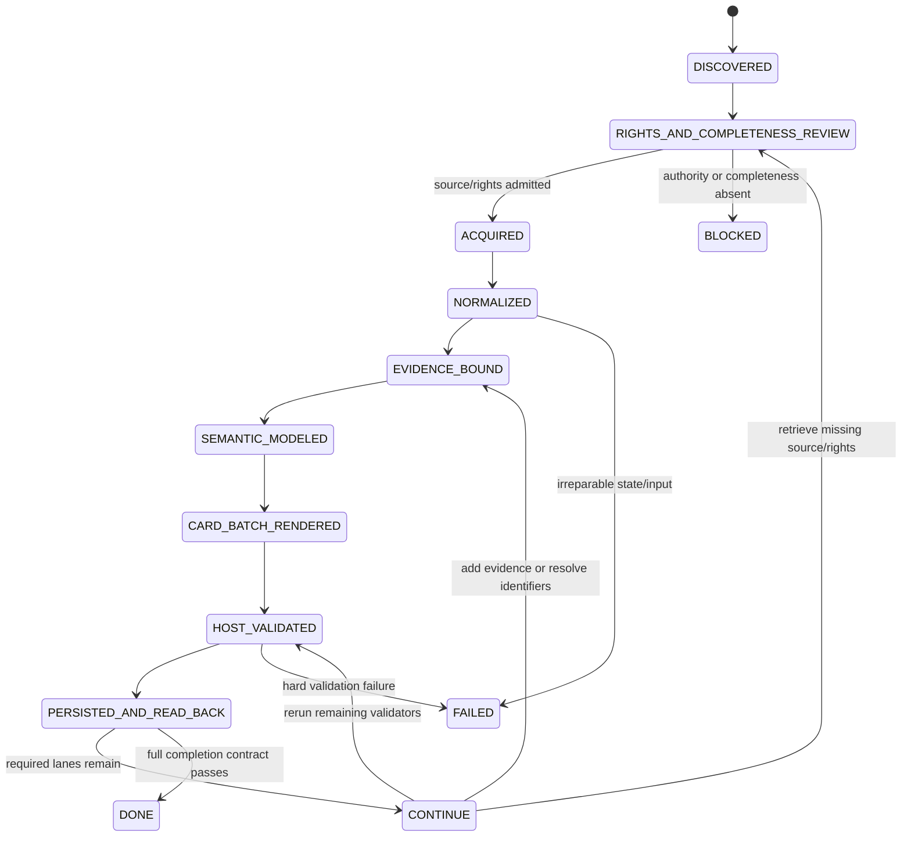

# AI Content Notes｜AI 高價值內容筆記與證據庫

> A private Evidence Plane that turns complete AI source material into source-constrained, payload-first v7.1 cards, machine sidecars, knowledge projections and review-gated claim candidates.
>
> 私有 Evidence Plane：把完整 AI 來源編譯成受證據約束、payload-first 的 v7.1 卡片、machine sidecars、知識投影與待審查 claim candidates。

## Start here｜卡片在哪裡

The canonical modified-flow card catalog is:

- [`evals/semantic-yield/README.md`](evals/semantic-yield/README.md)

As of 2026-08-14, only one content item has run the modified host-side Semantic Yield flow on `main`:

```text
evals/semantic-yield/CvRngaQZQ3Y/cards/
```

It contains ten cards and remains `CONTINUE`:

| Order | Stable ID | Series / decision use |
|---:|---|---|
| 1 | [`N-autonomy-trace-mining`](evals/semantic-yield/CvRngaQZQ3Y/cards/N-autonomy-trace-mining.md) | Narrative: autonomy → lower predictability → Trace Mining |
| 2 | [`C-model-harness-task-fit`](evals/semantic-yield/CvRngaQZQ3Y/cards/C-model-harness-task-fit.md) | Concept: `fit(Model, Harness, Task / Distribution)` |
| 3 | [`S-harness-finetune-harness`](evals/semantic-yield/CvRngaQZQ3Y/cards/S-harness-finetune-harness.md) | Strategy: Harness → ceiling → model update → re-Harness |
| 4 | [`T-trace-judge-comparison`](evals/semantic-yield/CvRngaQZQ3Y/cards/T-trace-judge-comparison.md) | Comparison: UNKNOWN-safe judge selection |
| 5 | [`P-trace-driven-improvement-cycle`](evals/semantic-yield/CvRngaQZQ3Y/cards/P-trace-driven-improvement-cycle.md) | Practice: replayable and rollback-capable loop |
| 6 | [`D-trace-scale-bottleneck`](evals/semantic-yield/CvRngaQZQ3Y/cards/D-trace-scale-bottleneck.md) | Detail: cost/context bottleneck |
| 7 | [`D-four-stage-trace-loop`](evals/semantic-yield/CvRngaQZQ3Y/cards/D-four-stage-trace-loop.md) | Detail: Ship → Collect → Mine → Experiment |
| 8 | [`C-continual-learning-state-planes`](evals/semantic-yield/CvRngaQZQ3Y/cards/C-continual-learning-state-planes.md) | Concept: Data / Harness / Memory planes |
| 9 | [`V-semantic-yield-replay`](evals/semantic-yield/CvRngaQZQ3Y/cards/V-semantic-yield-replay.md) | Verification: host replay, `PARTIAL` |
| 10 | [`K-visual-identifier-evidence-gap`](evals/semantic-yield/CvRngaQZQ3Y/cards/K-visual-identifier-evidence-gap.md) | Gap: visual and canonical-identifier evidence |

Do not confuse this with `evals/live/CvRngaQZQ3Y/`, which is the retained first transcript-only v7.1 evaluation batch. The `evals/live/` 12-card output did not run the complete modified Semantic Yield flow.

## Active protocol｜目前協議

```text
governance/CARD_PROTOCOL_CURRENT.json
  -> governance/CARD_PROTOCOL_V7_1.md
  -> git blob SHA-1 7f3019f4b41a90728cd48a523d742c7c59721bf6
```

v7.1 separates evidence-first compilation from task-value-first rendering. Human cards begin with the core proposition and why it matters; canonical key, revision, source dependencies and registry state move to the declared sidecar plane. v7.0 remains the fixed A/B/provenance baseline, and v6.6 remains historical.

## Repository directory map｜目錄結構

```text
ai-content-notes/
├── AGENTS.md / CLAUDE.md              # Agent read order and behavior contract
├── INTEGRATION_REQUIREMENTS.md         # cross-layer handoff and completion boundary
├── INDEX.md                            # navigation index
├── CONTEXT.md                          # downstream domain/capability mapping
├── governance/                         # immutable prompt, parameters and workflow SSOT
├── templates/                          # human/card/compiler templates
├── schemas/                            # machine-readable artifact contracts
├── tools/                              # acquisition, normalization, validation and export adapters
├── tests/                              # deterministic contract and regression tests
├── evals/
│   ├── prompt-ab/                      # v7.0 versus v7.1 fixed replay
│   ├── live/                           # acquisition-backed first-pass outputs / baselines
│   └── semantic-yield/
│       ├── README.md                   # all modified-flow batches
│       └── <content-id>/
│           ├── README.md               # batch entrypoint and card order
│           ├── cards/                  # one stable-ID Markdown file per card
│           ├── card-manifest.json      # prompt/source/card/blob bindings
│           ├── knowledge-views.md      # host-side graph projections
│           ├── semantic-validator-report.json
│           ├── semantic-yield.result.json
│           └── run-state.md
├── docs/
│   ├── SEMANTIC_YIELD_INTEGRATION_STATUS.md
│   ├── SEMANTIC_YIELD_VALIDATOR.md
│   └── git/
│       ├── README.md                   # Git/Stacked-PR governance entry
│       ├── REPO_PROFILE.md             # consumer-owned Worker profile
│       ├── GIT_TOWN_ADMISSION.md       # exact executable evidence state
│       ├── WORKER_PROTOCOL.md          # task packets, leases and outcomes
│       └── STACKED_PRS.md              # active stack + future leaf graph
├── notes/                              # historical Git note bodies
├── examples/                           # schemas and claim-map examples
└── .github/workflows/                  # canonical CI and acquisition workflows
```

## Directory-to-State-Machine ownership｜目錄對應的 State Machine 分工

| State / lane | Owning paths | Input | Output / receipt | Failure boundary |
|---|---|---|---|---|
| `DISCOVERED` | ranking/source selection outside or before batch materialization | candidate URL/source | content ID + task intent | snippet/title-only input blocks |
| `RIGHTS_AND_COMPLETENESS_REVIEW` | acquisition adapters, `governance/WORKFLOW.md` | candidate source | rights/completeness decision | unverified rights or incomplete source → `BLOCKED`/evaluation-only |
| `ACQUIRED` | `tools/ai_video_transcriber_*`, `tools/youtube_*`, acquisition workflows | authorized source | raw/private acquisition artifact + source manifest | transport success is not independent corroboration |
| `NORMALIZED` | `tools/normalize_rolling_transcript.py` | raw transcript/cues | deterministic normalized derivative + report | semantic/name repair is forbidden in normalization |
| `EVIDENCE_BOUND` | v7.1 Audit Plane contracts, manifests and evidence anchors | normalized source + dependency key | evidence/assertion candidates | missing anchor → inference/K card, not fabricated precision |
| `SEMANTIC_MODELED` | relation/thesis/projection layer and `knowledge-views.md` | evidence-bound claims | causal relations, thesis ranking, views | host view is not source-slide evidence |
| `CARD_BATCH_RENDERED` | `evals/semantic-yield/<id>/cards/`, `card-manifest.json` | semantic graph + render plan | source-driven stable card batch | fixed series quota must not override source decision value |
| `HOST_VALIDATED` | `tools/validate_semantic_yield_artifacts.py`, schema/tests/report | persisted batch | HG results + evidenced QG subset | model-authored PASS is insufficient |
| `PERSISTED_AND_READ_BACK` | batch directory, Git blobs, future Doc/Sheet adapters | validated artifacts | exact read-back identity | planned path or status prose is not persistence evidence |
| `CONTINUE` | `run-state.md`, `semantic-yield.result.json` | partial valid batch | next cursor + blockers | current `CvRngaQZQ3Y` state |
| `DONE` | complete v7.1 Completion Contract | all required source/QG/storage evidence | final state with no remaining work | unavailable while any required lane remains open |
| `BLOCKED` / `FAILED` | K/X/V state and run state | missing authority or irreparable input | explicit unblock/recovery contract | never silently downgrade to DONE |

## State machine｜狀態機



Current position:

```text
CvRngaQZQ3Y
  = PERSISTED_AND_READ_BACK
  -> CONTINUE
```

## Actual data flow｜實際資料流

```text
YouTube URL / complete source
  -> acquisition backend chain
  -> private raw transcript artifact
  -> deterministic rolling-caption normalization
  -> source dependency + digest contract
  -> immutable v7.1 prompt
  -> evidence/assertion modeling
  -> relation graph and central-thesis selection
  -> source-driven N/C/S/T/P/D/V/K cards
  -> knowledge-views.md
  -> deterministic semantic-validator-report.json
  -> semantic-yield.result.json + run-state.md
  -> Git read-back
  -> future Google Doc/sidecar/Sheet transaction
  -> claim map / privacy-preserving note delta
  -> Atlas review
  -> independent Skill qualification
```

Concrete current paths:

```text
evals/live/CvRngaQZQ3Y/
  -> retained first transcript-only v7.1 batch

evals/semantic-yield/CvRngaQZQ3Y/cards/
  -> current modified-flow card payloads

evals/semantic-yield/CvRngaQZQ3Y/knowledge-views.md
  -> grounded host projections

evals/semantic-yield/CvRngaQZQ3Y/semantic-validator-report.json
  -> deterministic HG/QG evidence

evals/semantic-yield/CvRngaQZQ3Y/run-state.md
  -> current `CONTINUE` cursor and remaining work
```

## Evidence lanes｜證據分流

```text
source statement != observed truth
source-reported test != current TESTED artifact
host projection != original visual evidence
note completed != claim verified
claim candidate != admitted claim
Skill compiled != Skill qualified
Git branch graph != live Git Town synchronization receipt
Git Town sync != implementation/test correctness
remote push != GitHub trusted check
GitHub trusted check != Human Admit
```

## Materialization status｜實作狀態

Materialized:

- immutable v7.1 prompt and lock pointer;
- versioned schemas/templates;
- saved-output A/B evaluator;
- rights-gated YouTube caption/authorized-ASR acquisition;
- deterministic rolling-caption normalization;
- retained first v7.1 evaluation batch under `evals/live/`;
- modified Semantic Yield 10-card batch and five human views;
- deterministic host validator with a ten-QG evidence subset;
- deterministic historical Git-note delta exporter;
- repository-owned card navigation, Agent routing, state-machine and Git/stack governance documents.

Incomplete or not materialized:

- generic live model/compiler provider adapter;
- provider/model raw-response receipt for the original card compilation;
- authorized frame/slide extraction and reviewed visual topology for this source;
- general source-dependency resolver;
- remaining QG-01..QG-24 evidence;
- Google Docs/Sheets transactional writer/read-back adapter;
- Drive-revision note-delta adapter;
- exact Git Town executable/version/checksum/legal admission;
- Worker worktree/lease/sync/publication wrappers and live canaries.

The documented target workflow must not be presented as an executed production pipeline until these gaps are closed.

## Deterministic validation｜契約驗證

```bash
python -m pip install -r requirements-contracts.txt
ruff check tools tests
python -m py_compile tools/*.py tests/*.py
pytest -q

python tools/validate_semantic_yield_artifacts.py \
  --target evals/semantic-yield/CvRngaQZQ3Y \
  --output evals/semantic-yield/CvRngaQZQ3Y/semantic-validator-report.json \
  --created-at 2026-08-14T01:15:00Z \
  --check
```

Current host-validated QG subset:

```text
QG-07 QG-08 QG-10 QG-11 QG-12
QG-16 QG-18 QG-20 QG-21 QG-23
```

All other gates remain `NOT_RUN` for this validator.

## Canonical entrypoints｜固定入口

- [`AGENTS.md`](AGENTS.md), [`CLAUDE.md`](CLAUDE.md)
- [`INTEGRATION_REQUIREMENTS.md`](INTEGRATION_REQUIREMENTS.md)
- [`evals/semantic-yield/README.md`](evals/semantic-yield/README.md)
- [`docs/SEMANTIC_YIELD_INTEGRATION_STATUS.md`](docs/SEMANTIC_YIELD_INTEGRATION_STATUS.md)
- [`docs/git/README.md`](docs/git/README.md)
- [`docs/git/REPO_PROFILE.md`](docs/git/REPO_PROFILE.md)
- [`docs/git/GIT_TOWN_ADMISSION.md`](docs/git/GIT_TOWN_ADMISSION.md)
- [`docs/git/WORKER_PROTOCOL.md`](docs/git/WORKER_PROTOCOL.md)
- [`docs/git/STACKED_PRS.md`](docs/git/STACKED_PRS.md)
- [`governance/CARD_PROTOCOL_CURRENT.json`](governance/CARD_PROTOCOL_CURRENT.json)
- [`governance/CARD_PROTOCOL_V7_1.md`](governance/CARD_PROTOCOL_V7_1.md)
- [`governance/PARAMETERS.md`](governance/PARAMETERS.md)
- [`governance/WORKFLOW.md`](governance/WORKFLOW.md)
- [`INDEX.md`](INDEX.md), [`CONTEXT.md`](CONTEXT.md), [`RANK.md`](RANK.md)
- [`docs/PROMPT_V7_1_AB_AND_SYSTEM_AUDIT.md`](docs/PROMPT_V7_1_AB_AND_SYSTEM_AUDIT.md)
- [`docs/SEMANTIC_YIELD_VALIDATOR.md`](docs/SEMANTIC_YIELD_VALIDATOR.md)

## Active Stack PR trace｜目前 Stack PR 追溯

Issue [#17](https://github.com/ed3c/ai-content-notes/issues/17) owns this stack:

```text
main
└── PR #18  agent/docs-card-catalog
    └── PR #19  agent/docs-agent-routing
        └── PR #20  agent/docs-state-machine
            └── PR #21  agent/docs-git-town-governance
```

| Stack | Branch | PR base | Molecular scope | Status |
|---:|---|---|---|---|
| 1 | `agent/docs-card-catalog` | `main` | card catalog + integration status SSOT | Draft PR #18 |
| 2 | `agent/docs-agent-routing` | Stack 1 | Agent read order and current state | Draft PR #19 |
| 3 | `agent/docs-state-machine` | Stack 2 | root directory/state/data-flow map + navigation test | Draft PR #20 |
| 4 | `agent/docs-git-town-governance` | Stack 3 | repo profile, admission blocker, Worker protocol and convergence index | Draft PR #21 |

Merge/retarget order:

```text
#18 -> #19 -> #20 -> #21
```

GitHub parent branches and draft PR publication are exercised. Live `git town sync`, linked worktree/lease canaries and Worker publication gates are `NOT_EXERCISED` or `NOT_IMPLEMENTED`; exact Git Town admission is `ABSENT`. See [`docs/git/STACKED_PRS.md`](docs/git/STACKED_PRS.md).

## Molecular runtime leaf stack｜分子化末端實作

The old draft PR #13 is not current `main` authority and should not be merged wholesale. Its runtime scope is decomposed into independently reviewable leaves:

```text
main
└── runtime/01-source-pack-and-run-receipt
    └── runtime/02-relation-graph-and-thesis-ranking
        ├── runtime/03a-knowledge-view-projections
        ├── runtime/03b-source-driven-batch-planner
        └── runtime/03c-semantic-yield-evaluator
            └── runtime/04-convergence-and-cvrngaqzq3y-replay

main
└── runtime/visual-01-rights-gated-frame-contracts
    └── runtime/visual-02-frame-extractor-and-annotation
        └── runtime/04-convergence-and-cvrngaqzq3y-replay

main
└── runtime/provider-01-model-run-adapter
    └── runtime/provider-02-raw-response-receipt
        └── runtime/04-convergence-and-cvrngaqzq3y-replay
```

Key rule:

```text
03a / 03b / 03c are sibling branches with disjoint path leases.
Visual and provider stacks are independent roots.
Only the convergence leaf owns shared fixtures, aggregate indexes and final replay.
```

The complete responsibilities, proposed path leases, dependencies and completion evidence are indexed in [`docs/git/STACKED_PRS.md`](docs/git/STACKED_PRS.md). These leaves are `PLANNED`, not implemented PRs.

## Git Town adoption status｜Git Town 採用狀態

```text
shared Skill binding: DOCUMENTED
repository profile: MATERIALIZED
remote branch graph: MATERIALIZED
exact Git Town admission: ABSENT / BLOCKED_POLICY
live sync: NOT_EXERCISED
background sync: DISABLED
Worker publication gate: NOT_IMPLEMENTED
merge/ship: HUMAN ADMIT
```

No `.git-town.toml`, sync wrapper or background loop should be treated as active before [`docs/git/GIT_TOWN_ADMISSION.md`](docs/git/GIT_TOWN_ADMISSION.md) is unblocked and the required negative controls pass.

## Historical delivery trace｜歷史交付

| PR | Purpose | Current meaning |
|---|---|---|
| #9 | v7.1 prompt lock, A/B harness and audit | protocol foundation |
| #11/#12 | transcript acquisition and complete first v7.1 output | retained `evals/live/` baseline |
| #15 | regenerated 10-card Semantic Yield batch | current modified-flow cards |
| #16 | deterministic Semantic Yield validator | current host validation |
| #13 | grounded runtime draft | open monolithic draft; decompose through the planned leaf graph before merge |

## Completion and privacy｜完成與隱私

A current note is completed only after complete-source/rights review, immutable prompt verification, registry-consistent cards, all required external gates, Google Doc read-back, sidecar read-back and exact Sheet write-back. Planned paths, status cells, prompt output and README prose are not completion evidence.

Complete private source/note bodies do not enter public or downstream deltas. This repository emits review-and-requalify signals only. Code, model weights, data, trajectories and source text have independent provenance and licenses.
