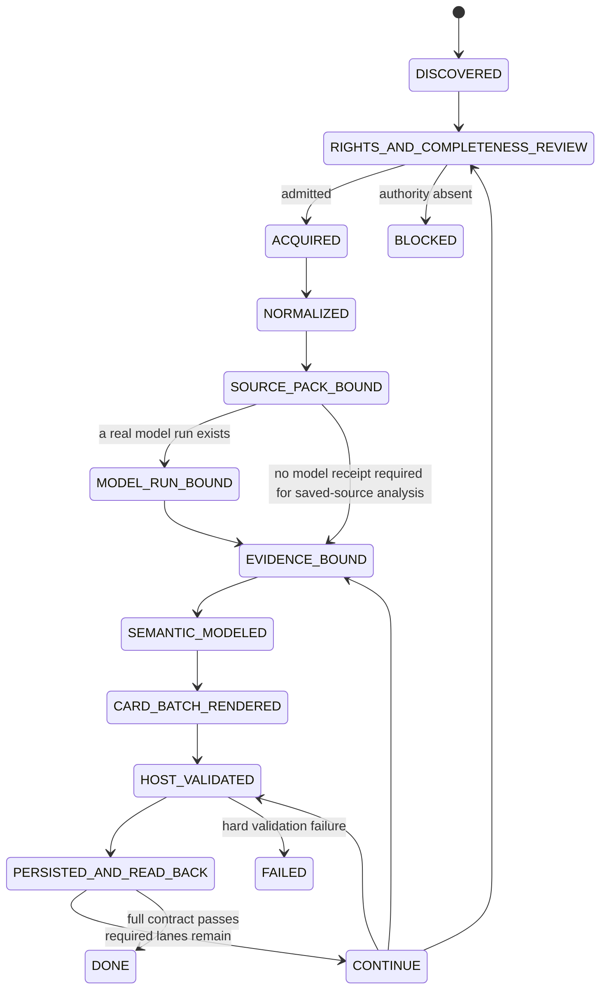

# AI Content Notes｜AI 高價值內容筆記與證據庫

> A private Evidence Plane that turns complete AI sources into source-constrained v7.1 cards, machine receipts, knowledge projections and review-gated claim candidates.

## Zero-context architecture｜先讀這裡

`ai-content-notes` 的新增角色是 **domain context supply plane**，但預設路徑必須保持輕量。它的目的不是把每篇文章轉成一套新框架，而是讓下一個 Agent 用更少決策取得足夠的 domain context，並只在必要時把知識提升成 executable architecture work。

Canonical contract: [`docs/DOMAIN_CONTEXT_SUPPLY_PLANE.md`](docs/DOMAIN_CONTEXT_SUPPLY_PLANE.md)

```text
External source / conversation / repeated failure / PR comment
  -> source-constrained cards
  -> candidate invariant / reusable domain concept
  -> Existing-System Check
  -> Promotion Gate
  -> Shape | Guard | Guide
  -> FeatureMap only for material actor-visible behavior/proof obligations
  -> Spatial Loop only for unresolved material closure questions
  -> executable/runtime proof
```

### Enforcement hierarchy

| Layer | Role | Default |
|---|---|---|
| `Shape` | repository/package/API/ownership structure makes the easiest local path the correct path | strongest preference |
| `Guard` | compiler/static analysis/lint/CI/runtime checks reject invalid states deterministically | use when Shape cannot eliminate the state |
| `Guide` | AGENTS.md / Skills / BugBot / style guidance handles contextual judgment | last resort for non-mechanical behavior |

If an invariant can be encoded mechanically, do not leave it only in human review comments or Agent instructions.

### Promotion Gate

```text
useful knowledge only? -> keep as knowledge; stop
recurring failure / missing invariant / reusable contract? -> otherwise stop
already encoded in target repo? -> map to authority; stop
missing? -> push to lowest deterministic owner: Shape -> Guard -> Guide
actor-visible behavior/proof obligations materially affected? -> FeatureMap
material unresolved behavioral/architectural closure remains? -> Spatial Loop
```

Code Graph, Product Graph, and Verification Graph are optional **derived analysis projections**. They are not three independent authoritative systems and are not mandatory for every source.

`CONVERGED knowledge != architecture promotion != FeatureMap coverage != runtime VERIFIED`.

## Start here｜卡片在哪裡

Modified-flow catalog: [`evals/semantic-yield/README.md`](evals/semantic-yield/README.md)

Only one content item has run the modified Semantic Yield flow:

```text
evals/semantic-yield/CvRngaQZQ3Y/cards/
```

It contains ten cards and remains `CONTINUE`:

| # | Stable ID | Decision use |
|---:|---|---|
| 1 | [`N-autonomy-trace-mining`](evals/semantic-yield/CvRngaQZQ3Y/cards/N-autonomy-trace-mining.md) | autonomy → lower predictability → Trace Mining |
| 2 | [`C-model-harness-task-fit`](evals/semantic-yield/CvRngaQZQ3Y/cards/C-model-harness-task-fit.md) | `fit(Model, Harness, Task / Distribution)` |
| 3 | [`S-harness-finetune-harness`](evals/semantic-yield/CvRngaQZQ3Y/cards/S-harness-finetune-harness.md) | Harness → ceiling → model update → re-Harness |
| 4 | [`T-trace-judge-comparison`](evals/semantic-yield/CvRngaQZQ3Y/cards/T-trace-judge-comparison.md) | UNKNOWN-safe judge comparison |
| 5 | [`P-trace-driven-improvement-cycle`](evals/semantic-yield/CvRngaQZQ3Y/cards/P-trace-driven-improvement-cycle.md) | replayable, rollback-capable procedure |
| 6 | [`D-trace-scale-bottleneck`](evals/semantic-yield/CvRngaQZQ3Y/cards/D-trace-scale-bottleneck.md) | trace cost/context bottleneck |
| 7 | [`D-four-stage-trace-loop`](evals/semantic-yield/CvRngaQZQ3Y/cards/D-four-stage-trace-loop.md) | Ship → Collect → Mine → Experiment |
| 8 | [`C-continual-learning-state-planes`](evals/semantic-yield/CvRngaQZQ3Y/cards/C-continual-learning-state-planes.md) | Data / Harness / Memory planes |
| 9 | [`V-semantic-yield-replay`](evals/semantic-yield/CvRngaQZQ3Y/cards/V-semantic-yield-replay.md) | host replay, `PARTIAL` |
| 10 | [`K-visual-identifier-evidence-gap`](evals/semantic-yield/CvRngaQZQ3Y/cards/K-visual-identifier-evidence-gap.md) | visual and identifier evidence gap |

Do not confuse it with:

```text
evals/live/CvRngaQZQ3Y/
```

`evals/live/` is the retained **transcript-only** 12-card v7.1 baseline; it did not run the complete modified flow.

## Active protocol｜目前協議

```text
governance/CARD_PROTOCOL_CURRENT.json
  -> governance/CARD_PROTOCOL_V7_1.md
  -> Git blob SHA-1 7f3019f4b41a90728cd48a523d742c7c59721bf6
```

The v7.1 prompt is immutable. Host runtime work must add contracts and evidence around it rather than patch its bytes.

## Repository directory map｜目錄結構

```text
ai-content-notes/
├── AGENTS.md / CLAUDE.md              # Agent read order and behavior
├── INTEGRATION_REQUIREMENTS.md         # cross-layer completion boundary
├── INDEX.md / CONTEXT.md               # navigation and downstream mapping
├── governance/                         # immutable prompt and workflow SSOT
├── templates/                          # human/compiler templates
├── schemas/                            # machine artifact contracts
├── tools/                              # acquisition, normalization, receipt and validation tools
├── tests/                              # deterministic contracts and negative controls
├── evals/
│   ├── prompt-ab/                      # fixed prompt A/B replay
│   ├── live/                           # transcript-only first-pass baselines
│   └── semantic-yield/
│       ├── README.md                   # modified-flow catalog
│       └── <content-id>/
│           ├── cards/
│           ├── card-manifest.json
│           ├── knowledge-views.md
│           ├── semantic-validator-report.json
│           ├── semantic-yield.result.json
│           └── run-state.md
├── docs/
│   ├── DOMAIN_CONTEXT_SUPPLY_PLANE.md # zero-context promotion + anti-overengineering contract
│   ├── runtime/README.md               # molecular runtime-leaf boundary
│   ├── SEMANTIC_YIELD_INTEGRATION_STATUS.md
│   └── git/
│       ├── REPO_PROFILE.md
│       ├── GIT_TOWN_ADMISSION.md
│       ├── WORKER_PROTOCOL.md
│       └── STACKED_PRS.md
└── .github/workflows/                  # canonical CI and acquisition workflows
```

## Directory-to-State-Machine ownership｜目錄對應的 State Machine 分工

| State / lane | Owning paths | Input | Output / receipt | Fail-closed boundary |
|---|---|---|---|---|
| `DISCOVERED` | source/ranking entry | candidate source | content ID + task | title/snippet-only blocks |
| `RIGHTS_AND_COMPLETENESS_REVIEW` | acquisition policy and `governance/WORKFLOW.md` | candidate | authority decision | missing rights/completeness blocks completion |
| `ACQUIRED` | YouTube/transcriber adapters and workflows | admitted source | private raw artifact + manifest | transport duplication is not corroboration |
| `NORMALIZED` | `tools/normalize_rolling_transcript.py` | raw cues | deterministic derivative + report | lexical repair is forbidden |
| `SOURCE_PACK_BOUND` | `tools/build_multimodal_source_pack.py`, source-pack schemas | persisted source artifacts | artifact digests, modalities, dependency and authority receipt | traversal, symlink, modality or authority drift fails |
| `MODEL_RUN_BOUND` | `tools/build_model_run_receipt.py`, run-receipt schemas | prompt/source/raw/compiled artifacts | exact provider/model/sampling/subject receipt | stale or mismatched subjects fail |
| `EVIDENCE_BOUND` | v7.1 Audit Plane | normalized source + dependency | evidence/assertion candidates | no anchor → inference/K, not fabricated precision |
| `SEMANTIC_MODELED` | relation/thesis/projection runtime | evidence-bound graph | thesis and human views | host view is not source-slide evidence |
| `CARD_BATCH_RENDERED` | `evals/semantic-yield/<id>/cards/` | semantic graph + render plan | stable source-driven cards | fixed series quota cannot override source value |
| `HOST_VALIDATED` | semantic validator tool/schema/tests | persisted batch | HG and evidenced QG subset | model-authored PASS is insufficient |
| `PERSISTED_AND_READ_BACK` | Git blobs; future Doc/Sheet adapters | validated artifacts | exact read-back identity | planned path/prose is not persistence evidence |
| `CONTINUE` | result + run state | partial valid batch | cursor + blockers | current `CvRngaQZQ3Y` state |
| `DONE` | full v7.1 Completion Contract | all lanes complete | no remaining work | unavailable while required evidence is open |
| `BLOCKED` / `FAILED` | K/X/V and run state | missing authority or invalid input | explicit recovery contract | never silently becomes DONE |

## State machine｜狀態機



Current card batch position:

```text
CvRngaQZQ3Y = PERSISTED_AND_READ_BACK -> CONTINUE
```

Domain promotion is a separate decision lane and must not be confused with content completion:

```text
knowledge pack
  -> may stop as knowledge-only
  -> may map to existing target-repo authority
  -> may promote to Shape / Guard / Guide
  -> may escalate to FeatureMap / Spatial Loop only when gate conditions hold
```

## Actual data flow｜實際資料流

```text
complete source
  -> rights/completeness gate
  -> acquisition + private raw artifact
  -> deterministic normalization
  -> multimodal-source-pack@1
  -> optional exact model-run-receipt@1
  -> immutable v7.1 evidence/assertion compilation
  -> relation graph + central thesis
  -> source-driven N/C/S/T/P/D/V/K cards
  -> knowledge views
  -> deterministic semantic validation
  -> result + run state + Git read-back
  -> optional Domain Context Promotion Gate
  -> future Google Doc/sidecar/Sheet transaction
  -> privacy-preserving claim delta
  -> Atlas review and independent Skill qualification
```

Concrete authority paths:

```text
evals/live/CvRngaQZQ3Y/                       # transcript-only baseline
evals/semantic-yield/CvRngaQZQ3Y/cards/      # current modified-flow cards
evals/semantic-yield/CvRngaQZQ3Y/knowledge-views.md
evals/semantic-yield/CvRngaQZQ3Y/semantic-validator-report.json
evals/semantic-yield/CvRngaQZQ3Y/run-state.md
docs/DOMAIN_CONTEXT_SUPPLY_PLANE.md           # domain promotion policy
```

## Evidence lanes｜證據分流

```text
source statement != observed truth
source-reported test != current TESTED artifact
source-pack receipt != source accuracy or claim truth
model-run receipt != model quality or claim verification
host projection != original visual evidence
knowledge convergence != architecture promotion
semantic similarity != target-repo coverage
FeatureMap mapping != runtime VERIFIED
note completed != claim admitted
Skill compiled != Skill qualified
Git branch graph != live Git Town synchronization receipt
GitHub check != Human Admit
```

## Materialization status｜實作狀態

Materialized:

- immutable v7.1 prompt and lock pointer;
- A/B evaluator and retained transcript-only baseline;
- rights-gated acquisition and rolling-caption normalization;
- current 10-card Semantic Yield batch and five human views;
- deterministic semantic validator with a ten-QG evidence subset;
- card catalog, Agent routing, State Machine, data flow and Git/stack governance;
- zero-context Domain Context Supply Plane architecture contract on the active documentation branch;
- **runtime Leaf 01**, merged as PR #24 / `d39d4791eed8c0cd3b1227ef8aeafd9685736e91`:
  - multimodal source-pack descriptor/receipt schemas;
  - provider-neutral model-run descriptor/receipt schemas;
  - deterministic builders and `--check` replay;
  - 10 focused negative/positive tests and runtime boundary docs.

Still incomplete:

- Issue #75 executable minimum Context Pack schema and Promotion Gate tests;
- live provider/model invocation adapter;
- provider/model raw-run receipt for the historical `CvRngaQZQ3Y` compilation;
- relation graph/thesis runtime extracted onto current `main`;
- knowledge-view, source-driven batch and HG evaluator leaves;
- authorized frame/slide extraction and reviewed topology;
- general source-dependency resolver;
- remaining QG evidence;
- transactional Google Docs/Sheets and Drive-revision adapters;
- exact Git Town executable admission and Worker canaries.

## Deterministic validation｜契約驗證

```bash
python -m pip install -r requirements-contracts.txt
ruff check tools tests
python -m py_compile tools/*.py tests/*.py
pytest -q

python tools/validate_semantic_yield_artifacts.py \
  --target evals/semantic-yield/CvRngaQZQ3Y \
  --output evals/semantic-yield/CvRngaQZQ3Y/semantic-validator-report.json \
  --created-at 2026-08-14T01:15:00Z \
  --check
```

Leaf 01 PR #24 passed Canonical Contracts and Ruff on Python 3.11 and 3.13. The existing host-validated QG subset remains:

```text
QG-07 QG-08 QG-10 QG-11 QG-12
QG-16 QG-18 QG-20 QG-21 QG-23
```

## Canonical entrypoints｜固定入口

- [`AGENTS.md`](AGENTS.md), [`CLAUDE.md`](CLAUDE.md)
- [`INTEGRATION_REQUIREMENTS.md`](INTEGRATION_REQUIREMENTS.md)
- [`docs/DOMAIN_CONTEXT_SUPPLY_PLANE.md`](docs/DOMAIN_CONTEXT_SUPPLY_PLANE.md)
- [Issue #75](https://github.com/ed3c/ai-content-notes/issues/75) — implementation/acceptance status for domain context promotion
- [`evals/semantic-yield/README.md`](evals/semantic-yield/README.md)
- [`docs/SEMANTIC_YIELD_INTEGRATION_STATUS.md`](docs/SEMANTIC_YIELD_INTEGRATION_STATUS.md)
- [`docs/runtime/README.md`](docs/runtime/README.md)
- [`docs/git/STACKED_PRS.md`](docs/git/STACKED_PRS.md)
- [`governance/CARD_PROTOCOL_CURRENT.json`](governance/CARD_PROTOCOL_CURRENT.json)
- [`governance/CARD_PROTOCOL_V7_1.md`](governance/CARD_PROTOCOL_V7_1.md)

## Completed documentation Stack PR trace｜已合併 Stack PR 追溯

```text
Merged PR #18 -> bbf92a4106b720f5b50707029779984d6672951f
Merged PR #19 -> 073fbdd2c1d09b71f22a30b7458aa0be06b932d6
Merged PR #20 -> c10f8b4572546262c34f93712c54798fdc451830
Merged PR #21 -> a2bd35a615c6754c5be70494bef55b65216bda7c
Merged PR #22 -> f67ccad478f30d6b17a4ebbf73aaab41f2f05dda
```

That proves the GitHub PR/retarget/merge lane, not a live Git Town execution.

## Molecular runtime leaf stack｜分子化末端實作

```text
main
└── Merged PR #24  runtime/01-source-pack-and-run-receipt
    └── runtime/02-relation-graph-and-thesis-ranking  [NEXT / PLANNED]
        ├── runtime/03a-knowledge-view-projections    [PLANNED]
        ├── runtime/03b-source-driven-batch-planner   [PLANNED]
        └── runtime/03c-semantic-yield-evaluator      [PLANNED]
            └── runtime/04-convergence-and-cvrngaqzq3y-replay [PLANNED]

main
└── runtime/visual-01-rights-gated-frame-contracts   [PLANNED]
    └── runtime/visual-02-frame-extractor-and-annotation
        └── runtime/04-convergence-and-cvrngaqzq3y-replay

main
└── runtime/provider-01-model-run-adapter             [PLANNED]
    └── runtime/provider-02-raw-response-receipt
        └── runtime/04-convergence-and-cvrngaqzq3y-replay
```

Leaf 01 is implemented; all remaining leaves are `PLANNED`, not implemented PRs. `03a/03b/03c` are siblings with disjoint path leases. Visual and provider stacks are independent roots. Only `runtime/04` may own shared fixtures, aggregate indexes, canonical CI convergence and the final 2×2 replay.

## Git Town adoption status

```text
shared Skill binding: DOCUMENTED
repository profile: MATERIALIZED
remote branch/PR graph: MATERIALIZED
exact Git Town admission: ABSENT / BLOCKED_POLICY
live sync: NOT_EXERCISED
worktree/lease/conflict canaries: NOT_EXERCISED
Worker publication gate: NOT_IMPLEMENTED
merge/ship: HUMAN ADMIT
```

No `.git-town.toml`, sync wrapper or background loop is active.

## Historical delivery trace

| PR | Current meaning |
|---:|---|
| #9 | immutable v7.1 prompt, A/B harness and audit |
| #11/#12 | acquisition and retained transcript-only output |
| #15 | current 10-card Semantic Yield output |
| #16 | deterministic card validator |
| #18–#22 | discoverability, Agent routing, State Machine and Stack governance |
| #24 | source-pack and model-run receipt foundation |
| #13 | open monolithic draft; extract remaining leaves, do not merge wholesale |

## Completion and privacy

A content item is `DONE` only after complete-source/rights review, immutable prompt verification, registry-consistent cards, all required gates, document/sidecar read-back and exact status write-back. Source and run receipts strengthen identity; they do not authorize completion by themselves.
