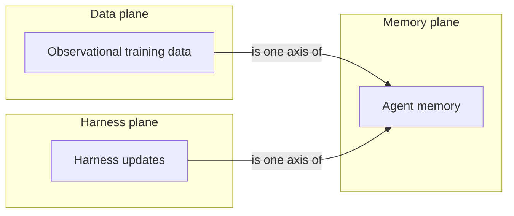

### N-autonomy-shifts-evidence-to-traces｜自主性換走了靜態可預測性，證據面因此移到 runtime trace

- **核心命題**：過去四年以確定性換取自主性之後，agent 行為不再能靠讀原始碼推得，改進所依據的觀測面因而移到可重播的 runtime trace。
- **為什麼重要**：若團隊仍以「讀 prompt 與 orchestration 原始碼」作為主要判斷方式，就無法回答 compaction 之後是否退化、換模型會不會更好這類只在執行軌跡上成立的問題。

- **核心衝突**：
  - 讀程式碼可以在腦中推演函式如何互相呼叫（來源以左側 code block 為例）。
  - agent 由 prompt、tools、skills、hooks、middleware 與 agent 間編排共同構成，人難以推斷一次 prompt 變更在規模下如何影響行為。
  - 同一個 prompt 變更在 medical 與 law 兩個 domain 的效果並不相同。
- **角色矩陣**：
  - 主角：要持續改進 production agent 的工程團隊。
  - 對立面：自主執行帶來的不可預測性、跨 domain 差異。
  - 次要變量：tracing 是否開啟、trace 是否集中、誰去讀。
- **Impact Anchors**：
  - [[EV-cvrngaqzq3y-v2-determinism-for-autonomy]]：`00:04:19.600–00:04:43.280`；來源說自 ChatGPT moment 起的四年間「trading determinism for autonomy」。
  - [[EV-cvrngaqzq3y-v2-code-vs-agent-reasoning]]：`00:03:29.560–00:04:19.600`；來源對比讀 code 與讀 agent 的差異，並點名 domain 差異。
  - [[EV-cvrngaqzq3y-v2-observability-coupling]]：`00:02:21.800–00:03:08.600`；來源把 observability 與 continual learning 綁在同一個回饋系統。
- **完整劇情鏈**：
  1. 起始狀態：團隊把 agent 投入真實環境運作。
  2. 壓力累積：行為由多層元件共同生成，靜態閱讀不再足以解釋結果。
  3. 決策／事件：把每次操作產生的 trace 全部保存下來。
  4. 轉折：改進問題從「改哪一行」變成「查哪一段軌跡」。
  5. 結果：trace 成為改進的基質，而非事後除錯的附屬品。
- **生態背景**：來源將此描述為整個領域的位移，而非單一團隊的工程偏好。
- **未解段落**：來源未提供量化證據說明靜態審查在何種規模下開始失效。
- **證據與狀態**：INFERENCE · SUPPORTED · MEDIUM
- **反證／限制**：若有團隊在不收集 trace 的情況下，仍能穩定且可量測地改進 production agent，本命題即被推翻。
- **Typed Links**：FLOW → [[C-fit-is-a-three-way-function]] · FLOW → [[P-four-step-trace-improvement-recipe]] · DEPENDS_ON → [[K-visual-and-identifier-gap]]

<!-- CARD_META
{
  "stable_id": "N-autonomy-shifts-evidence-to-traces",
  "canonical_key": "N | agent-autonomy | shifts | evidence-surface-to-runtime-traces | production-agent-systems | source-digest:304e9a05",
  "series": "N",
  "lifecycle": "ACTIVE",
  "revision": 1,
  "scope": "CvRngaQZQ3Y English auto-generated caption track retrieved 2026-08-14; user-directed evaluation only",
  "confidence_basis": "來源明確陳述 determinism/autonomy 取捨與 code/agent 對比；因果鏈為 bounded inference，無獨立實驗佐證。",
  "source_dependency_key": "youtube-video:CvRngaQZQ3Y",
  "source_provenance": [
    "youtube:CvRngaQZQ3Y:youtube-transcript-api#timestamp:00:02:21.800..00:04:43.280",
    "sha256:304e9a058721298f7498906d2539fdabdac515f2304645d52824e6719bc5f9bf"
  ],
  "unresolved_links": []
}
-->

### C-fit-is-a-three-way-function｜任務表現是 model、harness 與 task 的共同擬合

- **核心命題**：agent 的任務表現是 model、harness 與 task/資料分布三者共同擬合的結果，因此不能把回歸單獨歸因於模型。
- **為什麼重要**：把退步歸因於「換了模型」會讓團隊改錯變因；來源主張的工作變成「找好的 fit function」與「找好的資料」。

- **定義**：借用 scikit-learn 的 fit 概念——把資料、harness 與 model 一起擬合，使目標任務通過。
- **Non-Goals**：不宣稱存在單一最佳模型；不宣稱 harness 可以取代模型能力。
- **演化**：來源把「classical machine learning」定位在約六年前，並主張其擬合原則仍適用於 agent-first 世界。
- **底層機制**：演算法形式改變，但「取資料、取 harness、取模型、一起擬合」的流程未變。
- **Invariants**：三個變因中任一改變，任務表現都可能改變。
- **Boundary Conditions**：來源以 vertical、窄任務為主要場景；未涵蓋通用任務全分布。
- **正例**：把 base model 在特定垂直任務上 fine-tune，可達到甚至超越 frontier 表現（來源陳述）。
- **反例**：只看模型排行榜就預期任務表現同步提升。
- **證據與狀態**：INFERENCE · SUPPORTED · MEDIUM
- **反證／限制**：若任務表現在 harness 與任務分布固定時，仍能單由模型排名預測，本概念的解釋力即失效。
- **Typed Links**：ROOT ← [[N-autonomy-shifts-evidence-to-traces]] · FLOW → [[S-harness-then-tune-then-harness]]

<!-- CARD_META
{
  "stable_id": "C-fit-is-a-three-way-function",
  "canonical_key": "C | task-performance | is-jointly-determined-by | model-harness-task-fit | agent-first-engineering | source-digest:304e9a05",
  "series": "C",
  "lifecycle": "ACTIVE",
  "revision": 1,
  "scope": "CvRngaQZQ3Y English auto-generated caption track retrieved 2026-08-14; user-directed evaluation only",
  "confidence_basis": "來源直接提出 model harness task fit 並以 scikit-learn 類比；三因共同性為 inference，未給量化分解。",
  "source_dependency_key": "youtube-video:CvRngaQZQ3Y",
  "source_provenance": [
    "youtube:CvRngaQZQ3Y:youtube-transcript-api#timestamp:00:12:45.960..00:14:33.440",
    "sha256:304e9a058721298f7498906d2539fdabdac515f2304645d52824e6719bc5f9bf"
  ],
  "unresolved_links": []
}
-->

### C-dense-feedback-is-the-improvable-signal｜可改進的訊號來自密集回饋，不是通過與否

- **核心命題**：單一 pass/fail 數字不足以驅動改進；把回饋密集化才讓 agent 有下一步可走，而 trace 是承載這份回饋的基質。
- **為什麼重要**：許多 benchmark 只輸出一個分數，團隊據此調整等於在沒有梯度的地形上摸索。

- **定義**：密集回饋＝除了最終結果外，還保留執行過程中可歸因的中間訊號。
- **Non-Goals**：不主張取消最終分數；不主張所有中間訊號都有價值。
- **演化**：來源以 terminal bench 為例，指出其輸出「就是一個數字」。
- **底層機制**：agent 擅長讀 trace 並據以決定下一步；trace 保存了產生結果的過程。
- **Invariants**：回饋越稀疏，歸因越困難。
- **Boundary Conditions**：來源同時指出 agent 會為了讓分數上升而作弊，需要另行檢查。
- **正例**：讓 agent 讀自己的 trace、提出實驗、再嘗試修正（來源描述的 auto research 作法）。
- **反例**：只告訴受測者「你失敗了」而不給任何過程資訊。
- **證據與狀態**：SOURCE_STATEMENT · SUPPORTED · MEDIUM
- **反證／限制**：若有 agent 僅憑每題一個 pass/fail 位元即可穩定改進，本概念不成立。
- **Typed Links**：ROOT ← [[N-autonomy-shifts-evidence-to-traces]] · FLOW → [[P-four-step-trace-improvement-recipe]]

<!-- CARD_META
{
  "stable_id": "C-dense-feedback-is-the-improvable-signal",
  "canonical_key": "C | feedback-density | determines | agent-improvability | trace-driven-iteration | source-digest:304e9a05",
  "series": "C",
  "lifecycle": "ACTIVE",
  "revision": 1,
  "scope": "CvRngaQZQ3Y English auto-generated caption track retrieved 2026-08-14; user-directed evaluation only",
  "confidence_basis": "來源以 terminal bench 具體說明稀疏訊號問題並提出 densifying feedback；未提供量化對照。",
  "source_dependency_key": "youtube-video:CvRngaQZQ3Y",
  "source_provenance": [
    "youtube:CvRngaQZQ3Y:youtube-transcript-api#timestamp:00:14:33.440..00:16:01.560",
    "sha256:304e9a058721298f7498906d2539fdabdac515f2304645d52824e6719bc5f9bf"
  ],
  "unresolved_links": []
}
-->

### S-harness-then-tune-then-harness｜依回饋延遲排序介入：先 harness、再微調、再回 harness

- **核心命題**：改進順序應由回饋延遲決定——harness engineering 約兩分鐘就能得到回饋，先做；等它的天花板飽和，再考慮 fine-tune；之後視需要再回到 harness。
- **為什麼重要**：反過來先微調，會用最慢的迴圈去試最不確定的假設。

- **Objective**：在最短時間內取得可據以決策的回饋。
- **Preconditions**：已有 trace，且有可重複的評估方式。
- **策略邏輯**：先用低延遲手段窮盡可得的提升，再動用高成本手段跨越門檻。
- **Ecological Context**：來源說很多團隊只做 harness engineering 就已滿足客戶場景。
- **Trade-offs**：fine-tune 把成本結構從 token cost 移到 hardware cost；在高推論量下來源認為跑叢集更便宜。
- **Pre-mortem Glitches**：在 harness 尚未飽和時就微調，會把提升誤歸因於權重更新。
- **Success Criteria**：harness 調整已無可量測提升，才啟動微調。
- **Implementation Path**：harness 調整 → 觀察飽和 → 在窄垂直任務上微調 → 視需要再做 harness。
- **證據與狀態**：SOURCE_STATEMENT · SUPPORTED · MEDIUM
- **反證／限制**：若某團隊在越過來源所述門檻後，仍持續從 prompt 調整取得可量測提升，此排序即不成立。
- **Typed Links**：ROOT ← [[C-fit-is-a-three-way-function]] · FLOW → [[T-trace-judge-cost-comparison]]

<!-- CARD_META
{
  "stable_id": "S-harness-then-tune-then-harness",
  "canonical_key": "S | improvement-effort | is-ordered-by | feedback-latency | harness-and-finetune-sandwich | source-digest:304e9a05",
  "series": "S",
  "lifecycle": "ACTIVE",
  "revision": 1,
  "scope": "CvRngaQZQ3Y English auto-generated caption track retrieved 2026-08-14; user-directed evaluation only",
  "confidence_basis": "來源給出約兩分鐘的 harness 回饋時間與 sandwich 順序；門檻位置未量化。",
  "source_dependency_key": "youtube-video:CvRngaQZQ3Y",
  "source_provenance": [
    "youtube:CvRngaQZQ3Y:youtube-transcript-api#timestamp:00:09:00.920..00:10:27.520",
    "youtube:CvRngaQZQ3Y:youtube-transcript-api#timestamp:00:16:01.560..00:16:51.600",
    "sha256:304e9a058721298f7498906d2539fdabdac515f2304645d52824e6719bc5f9bf"
  ],
  "unresolved_links": []
}
-->

### P-four-step-trace-improvement-recipe｜四步 trace 改進程序

- **核心命題**：持續改進 agent 的可執行程序是：先上線、收集 trace、對 trace 做 data mining、再以資料驅動方式跑實驗。
- **為什麼重要**：缺少任一步，改進就退回成無法歸因的 prompt 微調。

- **Scenario**：已有 agent 可投入真實環境運作。
- **Value**：把散落的執行結果轉成可比較、可重播的實驗輸入。
- **Prerequisites**：tracing 已開啟；trace 集中在一個 tracing project（來源說可以 per agent 或跨 agent 集中）。
- **Inputs**：trace 資料、要回答的 decision question、模型與 harness 版本資訊。
- **Exploit / Procedure**：
  1. 上線 agent，使其在環境中運作並產生回饋。
  2. 保存每次操作產生的 trace（tool call、輸出訊息、API、CLI）。
  3. 對 trace 做 mining，產出 eval／資料集／給人閱讀的內容。
  4. 以先前 trace 為基準跑實驗，判斷新 prompt、工具或編排是否真的改善。
- **Expected Output**：可重播的 eval、可比較的實驗結果、供人審閱的摘要。
- **Rollback**：若實驗結果不可歸因，退回上一版 harness／模型設定並保留失敗紀錄。
- **Failure Handling**：trace 不完整時先修 instrumentation，不以殘缺資料下結論。
- **Security / Privacy Constraints**：來源提及 legal、medical 等高信任場域仍需人審；本 repo 另要求取材權利與素材保留。
- **Toolset**：tracing project、trace mining agent、eval runner；來源提及的產品名稱未能確認拼寫。
- **Execution Status**：UNTESTED
- **Validated By**：[[V-projection-replay-v2]]
- **證據與狀態**：SOURCE_STATEMENT · SUPPORTED · HIGH
- **Typed Links**：ROOT ← [[N-autonomy-shifts-evidence-to-traces]] · VALIDATED_BY → [[V-projection-replay-v2]] · DEPENDS_ON → [[D-trace-reading-cost-bottleneck]]

<!-- CARD_META
{
  "stable_id": "P-four-step-trace-improvement-recipe",
  "canonical_key": "P | improvement-team | executes | ship-collect-mine-experiment | production-agent-improvement | source-digest:304e9a05",
  "series": "P",
  "lifecycle": "ACTIVE",
  "revision": 1,
  "scope": "CvRngaQZQ3Y English auto-generated caption track retrieved 2026-08-14; user-directed evaluation only",
  "confidence_basis": "四個步驟由來源逐一列出並命名；步驟間的必要性為來源主張，未經本次執行驗證。",
  "source_dependency_key": "youtube-video:CvRngaQZQ3Y",
  "source_provenance": [
    "youtube:CvRngaQZQ3Y:youtube-transcript-api#timestamp:00:01:11.520..00:02:21.440",
    "sha256:304e9a058721298f7498906d2539fdabdac515f2304645d52824e6719bc5f9bf"
  ],
  "unresolved_links": []
}
-->

### T-trace-judge-cost-comparison｜Trace judge：frontier 與 open model 的對照與未知欄位

- **核心命題**：來源宣稱在其法律 benchmark 上，較便宜的 open model 可大致匹配 Opus 的 trace judging 能力，成本低約一到兩個數量級；精確分數與價格未給出，必須維持 UNKNOWN。
- **為什麼重要**：這是決定 trace judging 要不要花 frontier token 的關鍵對照，但可引用的只有量級，不是數字。

- **Decision Use**：決定 trace judging 由哪一類模型承擔。
- **Comparison Contract**：同一個法律 benchmark、同一個 judging 任務，harness 經過調整。
- **Dimensions**：

| Dimension | Frontier judge (Opus) | Open cheaper model |
|---|---|---|
| Trace judging capability | reference point | roughly matched（來源用語） |
| Relative cost | baseline | 低約 1–2 個數量級（來源用語） |
| Exact benchmark score | UNKNOWN | UNKNOWN |
| Exact price per million tokens | UNKNOWN | UNKNOWN |
| Model identity and version | Opus（僅點名系列） | UNKNOWN |

- **Interpretation**：可用於方向性決策，不可用於精確成本模型。
- **Decision Threshold**：在精確分數補齊前，僅在可接受量級誤差的場景採用 open model。
- **證據與狀態**：SOURCE_STATEMENT · SUPPORTED · LOW
- **反證／限制**：若在相同 benchmark 與相同 harness 投入下，open model 無法接近 frontier judging，本對照即失效。
- **Typed Links**：ROOT ← [[S-harness-then-tune-then-harness]] · DEPENDS_ON → [[K-visual-and-identifier-gap]]

<!-- CARD_META
{
  "stable_id": "T-trace-judge-cost-comparison",
  "canonical_key": "T | trace-judging | compares | frontier-against-open-model | cost-and-capability | source-digest:304e9a05",
  "series": "T",
  "lifecycle": "ACTIVE",
  "revision": 1,
  "scope": "CvRngaQZQ3Y English auto-generated caption track retrieved 2026-08-14; user-directed evaluation only",
  "confidence_basis": "來源以合作對象與 benchmark 具體陳述，但僅給量級；LOW 反映精確值缺席。",
  "source_dependency_key": "youtube-video:CvRngaQZQ3Y",
  "source_provenance": [
    "youtube:CvRngaQZQ3Y:youtube-transcript-api#timestamp:00:07:36.880..00:09:00.920",
    "sha256:304e9a058721298f7498906d2539fdabdac515f2304645d52824e6719bc5f9bf"
  ],
  "unresolved_links": []
}
-->

### D-trace-reading-cost-bottleneck｜讀 trace 的成本與 context 上限構成瓶頸

- **核心命題**：讀 trace 的成本約等於 input token 成本 × trace 數量 × 平均 trace 大小，且單一長軌跡本身就塞不進另一個 agent 的 context，因此必須把 context 當成可查詢的外部物件。
- **為什麼重要**：這決定 mining 是「把資料丟進 context」還是「建一個能查詢的系統」。

- **Entity**：大量且超長的 agent trace。
- **Behavior / Case**：與 coding agent（來源點名 Claude Code、Codex、deep agents）的長互動所產生的軌跡。
- **操作手法**：把 trace 視為外部物件並對其查詢，而非整段餵入 context。
- **獨特特徵**：成本同時受 trace 數量與單筆長度影響，兩者都在成長。
- **Shadow Evidence**：來源以「input token cost × 數量 × 平均大小」描述估算方式。
- **Outcome**：需要建立能有效率地從其他 agent 資料中挖掘的 agent。
- **Comparison Target**：直接把整份 trace 餵進另一個模型的作法。
- **證據與狀態**：SOURCE_STATEMENT · SUPPORTED · HIGH
- **反證／限制**：若長 coding agent 軌跡能被另一個 agent 完整讀入並有效分析，此瓶頸不成立。
- **Typed Links**：ROOT ← [[P-four-step-trace-improvement-recipe]] · CONFLICT → [[C-dense-feedback-is-the-improvable-signal]]

<!-- CARD_META
{
  "stable_id": "D-trace-reading-cost-bottleneck",
  "canonical_key": "D | trace-corpus | is-bounded-by | reading-cost-and-context-limit | trace-mining-systems | source-digest:304e9a05",
  "series": "D",
  "lifecycle": "ACTIVE",
  "revision": 1,
  "scope": "CvRngaQZQ3Y English auto-generated caption track retrieved 2026-08-14; user-directed evaluation only",
  "confidence_basis": "成本結構與 context 不足由來源直接描述並點名具體 coding agent。",
  "source_dependency_key": "youtube-video:CvRngaQZQ3Y",
  "source_provenance": [
    "youtube:CvRngaQZQ3Y:youtube-transcript-api#timestamp:00:06:42.400..00:07:36.880",
    "sha256:304e9a058721298f7498906d2539fdabdac515f2304645d52824e6719bc5f9bf"
  ],
  "unresolved_links": []
}
-->

### D-transport-locator-precision｜三條取材路徑內容一致，但 locator 精度差 4.6 倍

- **核心命題**：youtube-transcript-api、youtube-transcript.ai broker 與 AI-Video-Transcriber 在正規化後取得同一份內容，但每個證據錨所覆蓋的文字量分別是 207、959 與 385 字，且 broker 少收尾 19 秒。
- **為什麼重要**：內容一致會讓人以為取材路徑可以互換。就 Shadow Evidence 而言不能——指向 959 個字的 locator 無法支撐「精確引語」這件事。

- **Entity**：同一支影片的三條字幕取材路徑。
- **Behavior / Case**：以 v2 批次的 15 個證據錨，逐一在三份保留素材上解析。
- **操作手法**：對每個 `timestamp:start..end` 窗口計算命中 cue 數與窗內字數，取中位數比較。
- **獨特特徵**：
  - broker 只回 39 個 cue，單一 cue 可跨約 30 秒並攜帶滾動重複文字；
  - direct-caption 回 550 個 cue，正規化器對它是 no-op，因為它本來就沒有滾動重複；
  - AI-Video-Transcriber 回 543 個 cue，帶約兩倍重複。
- **Shadow Evidence**：`acquisition-comparison.json` 記錄 15 個錨在三條路徑上的解析結果；全部可解析，無一遺失。
- **Outcome**：卡片可跨路徑移植，但證據精度不可移植；預設路徑取 youtube-transcript-api。
- **Comparison Target**：把三條路徑視為等價可替換的作法。
- **證據與狀態**：OBSERVATION · TESTED · HIGH
- **反證／限制**：若在同一組錨上，broker 的窗口字數降到與 direct-caption 同級，此差異即消失；本卡不主張任何一條路徑的轉錄品質較高，只主張定位精度不同。
- **Typed Links**：ROOT ← [[N-autonomy-shifts-evidence-to-traces]] · CONFLICT → [[V-cross-transport-convergence]]

<!-- CARD_META
{
  "stable_id": "D-transport-locator-precision",
  "canonical_key": "D | caption-transports | differ-in | evidence-locator-precision | cvrngaqzq3y-comparison | source-digest:304e9a05",
  "series": "D",
  "lifecycle": "ACTIVE",
  "revision": 1,
  "scope": "CvRngaQZQ3Y three retained caption transports compared 2026-08-15; user-directed evaluation only",
  "confidence_basis": "每個數字都由保留素材上的確定性量測得出，非估計；三份素材皆已入庫並經 verify_source_retention.py 綁定。",
  "source_dependency_key": "youtube-video:CvRngaQZQ3Y",
  "source_provenance": [
    "artifact:evals/semantic-yield/CvRngaQZQ3Y-v2/acquisition-comparison.json",
    "artifact:sources/CvRngaQZQ3Y/source-manifest.json",
    "sha256:304e9a058721298f7498906d2539fdabdac515f2304645d52824e6719bc5f9bf"
  ],
  "unresolved_links": []
}
-->

### V-projection-replay-v2｜本次投影重播的驗證結果

- **核心命題**：本批次的五個知識投影可由已保留的字幕素材與已提交的 relation graph 確定性重播。
- **為什麼重要**：若不可重播，投影就只是一次性輸出，無法用於後續比較。

- **Target Assertion**：相同 source pack 與相同 relation graph 會產出相同的 projection bundle 與 knowledge views。
- **Verification Method**：以保留素材重建 source pack、relation graph、projection bundle，並比對摘要。
- **Oracle**：`relation-graph.json` 的 `graph_subject_digest` 與 `projection-bundle.json` 的 `source_graph_digest`。
- **Environment / Fixture**：本機執行；素材保留於 `sources/CvRngaQZQ3Y/` 並由 `verify_source_retention.py` 綁定。
- **Procedure**：取材 → 保留並驗證綁定 → source pack → relation graph → projection plan → knowledge views → HG 評估。
- **Expected Result**：五種投影全部渲染，來源未給的數值維持 UNKNOWN。
- **Observed Result**：PARTIAL
- **Verdict**：PARTIAL
- **Artifacts**：`source-pack.json`、`relation-graph.json`、`projection-bundle.json`、`knowledge-views.md`、`semantic-yield.result.json`。
- **Limitations**：未做跨執行的位元級重播比對；視覺模態全部封鎖；外部 QG 僅涵蓋既有子集。
- **證據與狀態**：OBSERVATION · TESTED · MEDIUM
- **反證／限制**：若以相同輸入重跑而 thesis 排序、節點 ID 或投影內容改變，重播宣稱即失效。
- **Typed Links**：ROOT ← [[P-four-step-trace-improvement-recipe]] · DEPENDS_ON → [[K-visual-and-identifier-gap]]

<!-- CARD_META
{
  "stable_id": "V-projection-replay-v2",
  "canonical_key": "V | projection-bundle | verifies | deterministic-replay-from-retained-source | cvrngaqzq3y-v2-run | not-run",
  "series": "V",
  "lifecycle": "ACTIVE",
  "revision": 1,
  "scope": "CvRngaQZQ3Y English auto-generated caption track retrieved 2026-08-14; user-directed evaluation only",
  "confidence_basis": "本次確實執行了完整鏈路並保留 artifacts；但未做第二次獨立重跑比對，故為 PARTIAL。",
  "source_dependency_key": "youtube-video:CvRngaQZQ3Y",
  "source_provenance": [
    "youtube:CvRngaQZQ3Y:youtube-transcript-api#timestamp:00:00:01.309..00:20:00.683",
    "sha256:304e9a058721298f7498906d2539fdabdac515f2304645d52824e6719bc5f9bf"
  ],
  "unresolved_links": []
}
-->

### V-cross-transport-convergence｜三條路徑正規化後收斂，且重現了先前判定遺失的 v1 產物

- **核心命題**：三條取材路徑經滾動字幕正規化後收斂到同一份內容；其中 broker 路徑重現的 digest 與先前記錄為遺失的 v1 逐字稿位元完全相同。
- **為什麼重要**：先前把 v1 素材判為不可挽回，因而把 leaf 04 判為永久受阻。該判斷被本次執行推翻。

- **Target Assertion**：`youtube-transcript.ai` 取材經 `normalize_rolling_transcript.py` 後，可重現 v1 記錄的 `normalized_transcript_sha256`。
- **Verification Method**：重新取材、正規化、計算 SHA-256，與 `evals/live/CvRngaQZQ3Y/card-manifest.json` 記錄值比對。
- **Oracle**：`bf993b8d98717284f58139bfa93955b1bbfcb0128ca386b1913e98d2a4eef462`。
- **Environment / Fixture**：本機執行 2026-08-15；三份素材保留於 `sources/CvRngaQZQ3Y/` 並經綁定驗證。
- **Procedure**：三條路徑各取材一次 → 各自正規化 → 比對 digest 與詞袋重疊 → 以 15 個 v2 錨逐一解析。
- **Expected Result**：內容收斂；v1 digest 重現。
- **Observed Result**：PASS
- **Verdict**：PASS
- **Artifacts**：`acquisition-comparison.json`、`sources/CvRngaQZQ3Y/broker/normalization-report.json`、`sources/CvRngaQZQ3Y/source-manifest.json`。
- **Limitations**：三條路徑共用同一個 `youtube-video:CvRngaQZQ3Y` 依賴與同一份自動字幕，因此彼此一致只是傳輸保真度，**不構成獨立佐證**；另有兩條需要真實 rights basis 的路徑未執行。
- **證據與狀態**：OBSERVATION · TESTED · HIGH
- **反證／限制**：若同一流程再次執行而 digest 不再吻合，重現宣稱即失效。
- **Typed Links**：ROOT ← [[D-transport-locator-precision]] · DEPENDS_ON → [[K-visual-and-identifier-gap]]

<!-- CARD_META
{
  "stable_id": "V-cross-transport-convergence",
  "canonical_key": "V | three-caption-transports | verifies | normalized-content-convergence | cvrngaqzq3y-comparison | run-local-2026-08-15",
  "series": "V",
  "lifecycle": "ACTIVE",
  "revision": 1,
  "scope": "CvRngaQZQ3Y three retained caption transports compared 2026-08-15; user-directed evaluation only",
  "confidence_basis": "digest 比對為位元級相等，非相似度判斷；比對雙方皆可回讀。",
  "source_dependency_key": "youtube-video:CvRngaQZQ3Y",
  "source_provenance": [
    "artifact:evals/semantic-yield/CvRngaQZQ3Y-v2/acquisition-comparison.json",
    "artifact:evals/live/CvRngaQZQ3Y/card-manifest.json",
    "sha256:304e9a058721298f7498906d2539fdabdac515f2304645d52824e6719bc5f9bf"
  ],
  "unresolved_links": []
}
-->

### K-visual-and-identifier-gap｜投影片、圖表與產品識別字仍不可驗證

- **核心命題**：本批次全部由自動字幕推導，投影片、圖表與若干專有名詞未取得可驗證來源，因此不得當作精確識別依據。
- **為什麼重要**：把自動字幕的拼寫當成產品名或方法名，會把轉錄誤差寫進知識庫。

- **Unknown**：影片中 slide 的實際內容、legal benchmark 圖表數值、產品名稱正確拼寫，以及被字幕寫成 `OPD, OPSD, trySFT` 的 RL 方法名稱。
- **Why Unresolved**：權利依據為 user-directed-evaluation，沒有取得授權的本機影片、creator slides 或人工校對稿。
- **Impact**：`T-trace-judge-cost-comparison` 的精確欄位必須維持 UNKNOWN；產品名稱不得寫入任何下游 claim。
- **Evidence Needed**：授權影片檔、frame SHA-256、timestamp 加 bbox、人工校對的轉錄稿與術語表。
- **Retrieval / Test Plan**：取得可驗證的媒體權利 → 依 `frame_sampling_plan.py` 抽 frame 並保存 digest → 依 `visual-evidence-receipt@1` 記錄 bbox 與標註。
- **Unblock Criteria**：`governance/RIGHTS_ALLOWLIST.json` 出現該影片的 `verified` 記錄，且存在人工校對稿。
- **Priority**：HIGH
- **證據與狀態**：OBSERVATION · SUPPORTED · HIGH
- **Typed Links**：ROOT ← [[N-autonomy-shifts-evidence-to-traces]]

<!-- CARD_META
{
  "stable_id": "K-visual-and-identifier-gap",
  "canonical_key": "K | visual-and-identifier-evidence | blocks | exact-slide-and-name-reconstruction | cvrngaqzq3y-v2-run | run-local-2026-08-14",
  "series": "K",
  "lifecycle": "ACTIVE",
  "revision": 1,
  "scope": "CvRngaQZQ3Y English auto-generated caption track retrieved 2026-08-14; user-directed evaluation only",
  "confidence_basis": "字幕本身即顯示不確定拼寫；缺席的媒體與校對稿由本次取材收據直接佐證。",
  "source_dependency_key": "youtube-video:CvRngaQZQ3Y",
  "source_provenance": [
    "youtube:CvRngaQZQ3Y:youtube-transcript-api#timestamp:00:10:27.920..00:11:03.200",
    "youtube:CvRngaQZQ3Y:youtube-transcript-api#timestamp:00:14:08.680..00:14:33.440",
    "sha256:304e9a058721298f7498906d2539fdabdac515f2304645d52824e6719bc5f9bf"
  ],
  "unresolved_links": []
}
-->

---

# Knowledge views

## 自主性下降的可預測性如何把 trace 變成改進基質

```mermaid
flowchart LR
    NODE_agent_autonomy_ead78c726c3b["Agent autonomy"]
    NODE_static_predictability_868184098646["Static predictability of agent behaviour"]
    NODE_runtime_traces_3f5dcde1768d["Runtime traces"]
    NODE_trace_mining_f1989ee25c20["Trace mining"]
    NODE_generated_evals_81f1a36fe173["Generated evals and environments"]
    NODE_harness_engineering_43f588eb0663["Harness engineering"]
    NODE_context_window_limit_026c34d42317["Trace size against the context window"]
    NODE_agent_autonomy_ead78c726c3b -->|is traded against| NODE_static_predictability_868184098646
    NODE_static_predictability_868184098646 -->|lowers, which elevates| NODE_runtime_traces_3f5dcde1768d
    NODE_runtime_traces_3f5dcde1768d -->|feeds| NODE_trace_mining_f1989ee25c20
    NODE_trace_mining_f1989ee25c20 -->|produces| NODE_generated_evals_81f1a36fe173
    NODE_generated_evals_81f1a36fe173 -->|constrains| NODE_harness_engineering_43f588eb0663
    NODE_context_window_limit_026c34d42317 -->|bounds| NODE_trace_mining_f1989ee25c20
```

<!-- PROJECTION_ID: PROJ-v2-trace-loop -->



## Trace judge：frontier 與 open model 的成本對照

<!-- PROJECTION_ID: PROJ-v2-judge-comparison -->

| Dimension | Frontier judge (Opus) | Open cheaper model |
|---|---|---|
| Trace judging capability on the stated legal benchmark | reference point | roughly matched |
| Relative cost | baseline | 1–2 orders of magnitude cheaper (source wording) |
| Exact benchmark score | UNKNOWN | UNKNOWN |
| Exact price per million tokens | UNKNOWN | UNKNOWN |
| Model identity and version | Opus (family named, version not stated) | UNKNOWN |

## 持續改進 agent 的四步配方

<!-- PROJECTION_ID: PROJ-v2-recipe-timeline -->

1. **Ship the agent into a real environment** — `[[NODE-agent-autonomy-ead78c726c3b]]`
2. **Collect traces from every operation** — `[[NODE-runtime-traces-3f5dcde1768d]]`
3. **Mine the trace data** — `[[NODE-trace-mining-f1989ee25c20]]`
4. **Run data-driven experiments against prior traces** — `[[NODE-generated-evals-81f1a36fe173]]`

## Continual learning 的三個更新面

<!-- PROJECTION_ID: PROJ-v2-continual-learning-planes -->



## Model–Harness–Task fit

<!-- PROJECTION_ID: PROJ-v2-fit-equation -->

```text
task_performance = fit(model, harness, task_distribution)
```

| Symbol | Meaning | Graph node |
|---|---|---|
| `fit` | the joint fit the talk borrows from scikit-learn | `[[NODE-model-harness-task-fit-184d14eedd96]]` |
| `task_performance` | what a leaderboard alone cannot explain | `[[NODE-agent-task-performance-5ba7a2129b5c]]` |
