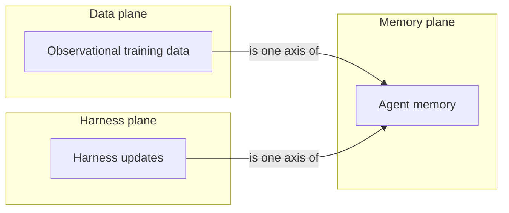

## 自主性下降的可預測性如何把 trace 變成改進基質

```mermaid
flowchart LR
    NODE_agent_autonomy_ead78c726c3b["Agent autonomy"]
    NODE_static_predictability_868184098646["Static predictability of agent behaviour"]
    NODE_runtime_traces_3f5dcde1768d["Runtime traces"]
    NODE_trace_mining_f1989ee25c20["Trace mining"]
    NODE_generated_evals_81f1a36fe173["Generated evals and environments"]
    NODE_harness_engineering_43f588eb0663["Harness engineering"]
    NODE_context_window_limit_026c34d42317["Trace size against the context window"]
    NODE_agent_autonomy_ead78c726c3b -->|is traded against| NODE_static_predictability_868184098646
    NODE_static_predictability_868184098646 -->|lowers, which elevates| NODE_runtime_traces_3f5dcde1768d
    NODE_runtime_traces_3f5dcde1768d -->|feeds| NODE_trace_mining_f1989ee25c20
    NODE_trace_mining_f1989ee25c20 -->|produces| NODE_generated_evals_81f1a36fe173
    NODE_generated_evals_81f1a36fe173 -->|constrains| NODE_harness_engineering_43f588eb0663
    NODE_context_window_limit_026c34d42317 -->|bounds| NODE_trace_mining_f1989ee25c20
```

<!-- PROJECTION_ID: PROJ-v2-trace-loop -->



## Trace judge：frontier 與 open model 的成本對照

<!-- PROJECTION_ID: PROJ-v2-judge-comparison -->

| Dimension | Frontier judge (Opus) | Open cheaper model |
|---|---|---|
| Trace judging capability on the stated legal benchmark | reference point | roughly matched |
| Relative cost | baseline | 1–2 orders of magnitude cheaper (source wording) |
| Exact benchmark score | UNKNOWN | UNKNOWN |
| Exact price per million tokens | UNKNOWN | UNKNOWN |
| Model identity and version | Opus (family named, version not stated) | UNKNOWN |

## 持續改進 agent 的四步配方

<!-- PROJECTION_ID: PROJ-v2-recipe-timeline -->

1. **Ship the agent into a real environment** — `[[NODE-agent-autonomy-ead78c726c3b]]`
2. **Collect traces from every operation** — `[[NODE-runtime-traces-3f5dcde1768d]]`
3. **Mine the trace data** — `[[NODE-trace-mining-f1989ee25c20]]`
4. **Run data-driven experiments against prior traces** — `[[NODE-generated-evals-81f1a36fe173]]`

## Continual learning 的三個更新面

<!-- PROJECTION_ID: PROJ-v2-continual-learning-planes -->



## Model–Harness–Task fit

<!-- PROJECTION_ID: PROJ-v2-fit-equation -->

```text
task_performance = fit(model, harness, task_distribution)
```

| Symbol | Meaning | Graph node |
|---|---|---|
| `fit` | the joint fit the talk borrows from scikit-learn | `[[NODE-model-harness-task-fit-184d14eedd96]]` |
| `task_performance` | what a leaderboard alone cannot explain | `[[NODE-agent-task-performance-5ba7a2129b5c]]` |
