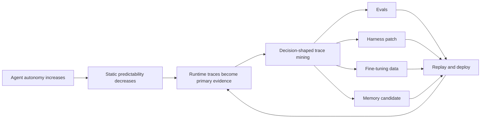

### N-autonomy-trace-mining｜當靜態可預測性下降，Trace 成為 Agent 改進的主要證據面

- **核心命題**：Agent 以更高自主性換取更低的靜態可預測性；因此，系統改進的主要觀測面會從「只讀程式碼推斷行為」移到「執行後收集、查詢與比較 traces」。
- **為什麼重要**：如果團隊只有 prompt、tools 與 orchestration 原始碼，卻沒有可重播 traces、task identity、outcome 與版本資訊，就無法可靠判斷錯誤來自 model capability、harness guidance、context compaction、tool contract 或環境狀態。

- **核心衝突**：
  - Agent 的行為由 model、prompt、tools、skills、hooks、middleware、memory 與 environment 共同生成。
  - 自主性提高後，執行路徑不再等同於一條可由人類逐行預演的固定控制流。
  - 但直接把全部 traces 放回另一個 model，會同時撞上資料量、input-token cost 與 context-window 上限。
- **角色矩陣**：
  - 主角：需要持續改善 production Agent 的工程團隊。
  - 對立面：非確定執行、長跨度軌跡、trace 數量與 context/cost barrier。
  - 次要變量：judge model、harness、eval、fine-tuning dataset、memory admission 與人工審查。
- **Impact Anchors**：
  - [[EV-cvrngaqzq3y-observability-learning]]：`00:02:17–00:03:17`；來源把 traces 與 continual learning 的必要輸入連結起來。
  - [[EV-cvrngaqzq3y-trace-questions]]：`00:04:48–00:05:50`；來源列出 good/bad interactions、compaction 後退化與 model counterfactual 等決策問題。
  - [[EV-cvrngaqzq3y-trace-scale]]：`00:06:21–00:07:22`；來源描述大量、超長 traces 無法直接完整塞入另一個 Agent context。
- **完整劇情鏈**：
  1. 起始狀態：團隊部署一個能在環境中採取行動的 Agent。
  2. 壓力累積：錯誤不再只對應單一函式或固定 branch；model、harness 與環境交互形成長軌跡。
  3. 決策／事件：團隊保存 traces，並以明確 decision question 查詢行為案例，而不是只產生摘要。
  4. 轉折：trace cases 被轉成 eval、harness patch、model comparison、fine-tuning data 或 memory candidate。
  5. 結果：Agent 改進成為一個可重播的 data-mining loop，而不是一次性的 prompt 修改。
- **生態背景**：來源把 observability 與 continual learning 視為同一回饋系統的兩側；前者保存行為證據，後者決定哪些證據能改變 model、harness 或 memory。
- **未解段落**：來源沒有提供固定 benchmark、完整成本表或 longitudinal experiment，無法量化每一層更新對品質的獨立因果貢獻。

- **證據與狀態**：INFERENCE · SUPPORTED · MEDIUM
  - [[EV-cvrngaqzq3y-observability-learning]]、[[EV-cvrngaqzq3y-trace-questions]]、[[EV-cvrngaqzq3y-trace-scale]] 共同支持此因果鏈；它仍是由單一 secondary auto-caption transcript 建立的 bounded inference。
- **反證／限制**：若系統其實是固定 DAG、封閉 toolset、無 model 自主決策且所有 branch 都可由 deterministic tests 覆蓋，Trace Mining 的邊際價值會下降；它不會因此完全失去 debugging 價值。
- **Typed Links**：
  - ROOT ← [[D-four-stage-trace-loop]]
  - FLOW → [[C-model-harness-task-fit]]
  - FLOW → [[P-trace-driven-improvement-cycle]]
  - DEPENDS_ON → [[K-visual-identifier-evidence-gap]]

<!-- CARD_META
{
  "stable_id": "N-autonomy-trace-mining",
  "canonical_key": "N | agent-autonomy | shifts | static-reasoning-to-trace-mining | production-agent-systems | source-digest:bf993b8d",
  "series": "N",
  "lifecycle": "ACTIVE",
  "revision": 1,
  "scope": "CvRngaQZQ3Y secondary auto-generated transcript; semantic-yield regeneration",
  "confidence_basis": "Multiple timestamp spans from one dependency support the causal chain; no independent experimental corroboration.",
  "source_dependency_key": "youtube-video:CvRngaQZQ3Y",
  "source_provenance": [
    "youtube:CvRngaQZQ3Y:youtube-transcript-ai#timestamp:00:02:17..00:07:22",
    "sha256:bf993b8d98717284f58139bfa93955b1bbfcb0128ca386b1913e98d2a4eef462"
  ],
  "projection_kind": "causal-dataflow",
  "unresolved_links": []
}
-->
