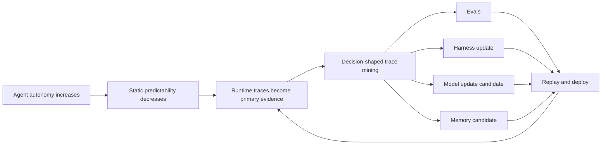

# CvRngaQZQ3Y｜Semantic Yield Knowledge Views

These are host-side projections derived from grounded card relations. They are not reconstructions of the original slides because no authorized frame artifact was available.

## 1. Autonomy → Trace Mining



## 2. Model–Harness–Task Fit

```text
Data / Traces
      |
      v
fit(Model, Harness, Task / Distribution) -> Agent Performance
```

## 3. Intervention Sequence

```text
Harness Engineering
        v
Measured Harness Ceiling
        v
Model Update Candidate
        v
Harness Engineering Again
```

## 4. Continual-Learning State Planes

```text
Data Plane -----+
Harness Plane --+--> Continual Learning --> Replay / Review
Memory Plane ---+
```

## 5. Trace Judge Comparison

| Dimension | Frontier reference | Open-model candidate |
|---|---|---|
| Role | Capability reference | Lower-cost candidate |
| Exact revision | UNKNOWN | UNKNOWN |
| Benchmark artifact | UNKNOWN | UNKNOWN |
| Quality claim | Reference | Source says roughly comparable; unverified |
| Cost claim | UNKNOWN | Source says 1 or 2 orders lower; unverified |
| Decision status | PROVISIONAL | PROVISIONAL |

## Visual-evidence state

```text
original video frames: NOT_AVAILABLE_TO_THIS_RUN
slide/chart reconstruction: DEFERRED
relation projection: AVAILABLE
raw visual text authority: false
```
